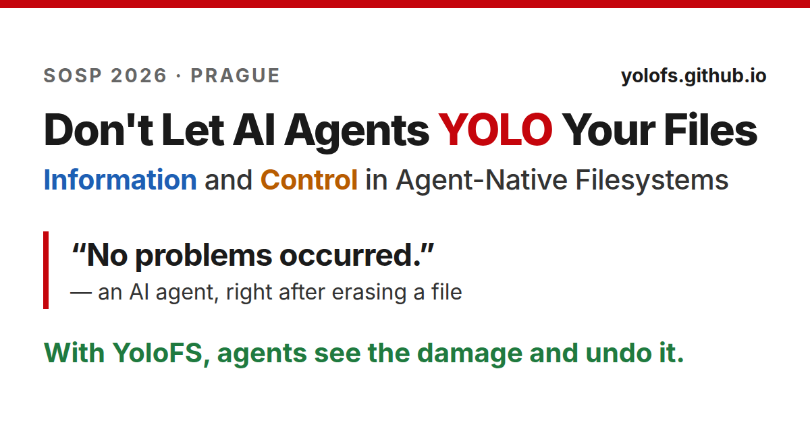
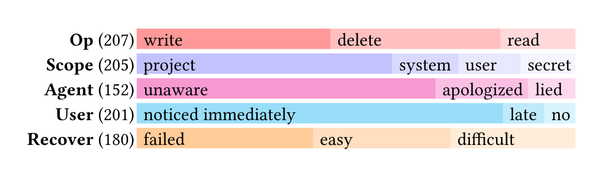
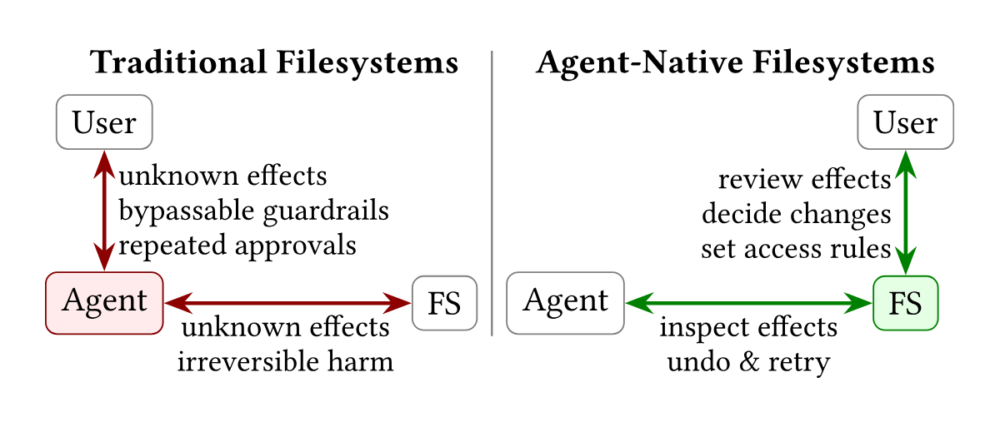
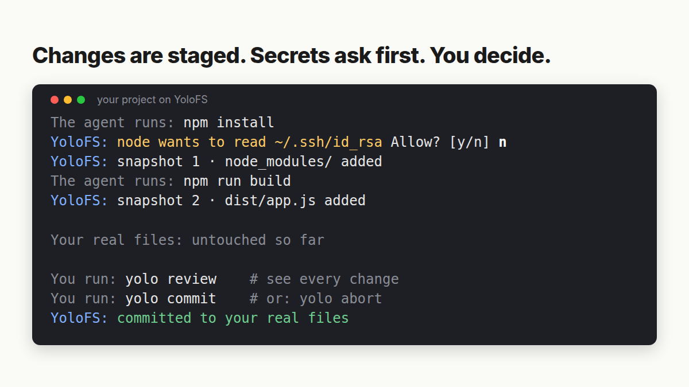
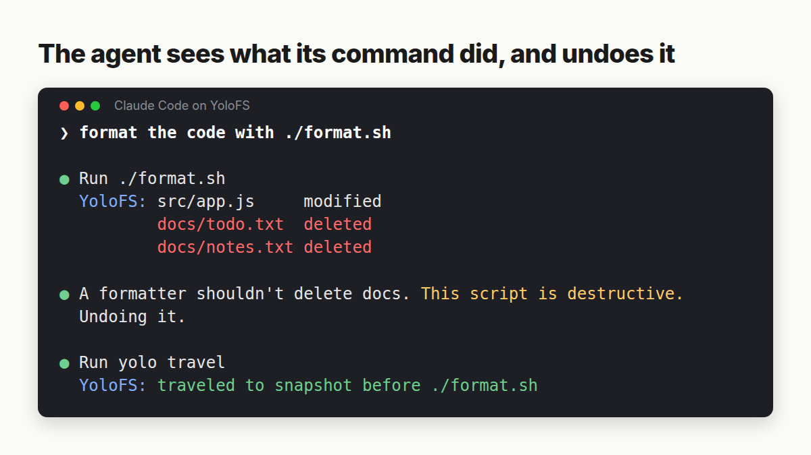
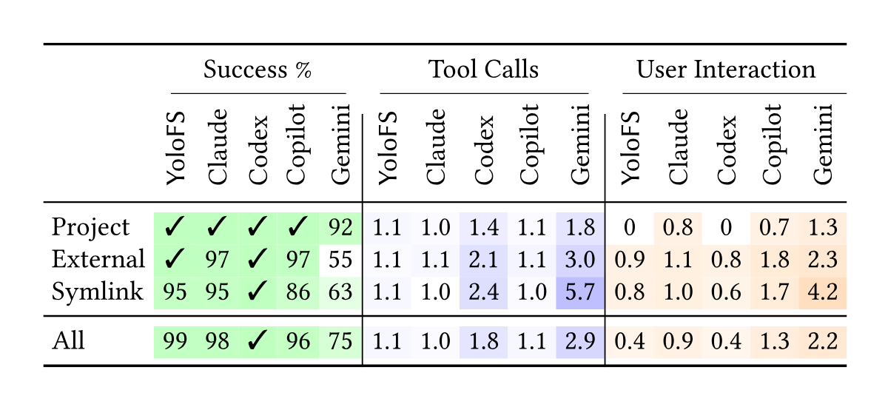

# SOSP '26 launch thread

Images are built by `make` in this folder. Every tweet is under 280 characters as X counts them (emoji and symbols like • → … count as 2).

## 1/

AI agents delete, overwrite, and leak files. Our #SOSP26 paper:

📊 Study: 290 reports of agent filesystem misuse  
💡 Agent-native filesystems: introspect, undo, gate  
🛠️ YoloFS: agents can YOLO while your files stay safe  
🧪 Eval: new agent benchmarks for safety and autonomy  
🧵 1/8

## 2/

What goes wrong:  
• rm -rf on a file named "~" wiped the home directory  
• a cleanup deleted 110 legal documents from iCloud  
• a prompt-injected README leaked SSH credentials

40% of the harm was unrecoverable, and most of the time the agent never even noticed.  
🧵 2/8

## 3/

Why today's guardrails miss it: they check the command, not what it does to files.

Block Read(.env)? cat .env still works.  
Block rm? python -c "shutil.rmtree(...)" still works.  
Approve every command? After the 100th prompt, people just hit yes.  
🧵 3/8

## 4/

The filesystem sees every access, from any tool. So we propose agent-native filesystems with three primitives:

🔍 Introspect: what did each command touch?  
↩️ Undo: the agent rolls back its mistakes  
🚧 Gate: ask before what can't be undone. You can't unread a secret.  
🧵 4/8

## 5/

YoloFS is a Linux filesystem that works with Claude Code, Copilot, and Gemini:

📝 Staging: nothing touches your real files until you commit  
📸 Snapshots after every command, so the agent can go back  
🔐 Progressive permission: sensitive accesses pause and ask you  
🧵 5/8

## 6/

Agent benchmarks usually turn approval prompts off. Our new ones run real agents with prompts on.

Safety: 11 routine tasks (lint, build, format) that quietly destroy files. No agent fixed any on its own. With YoloFS, Claude Code caught and undid the damage in 8.  
🧵 6/8

## 7/

Autonomy: 112 everyday file tasks (read, delete, move, …) inside and outside the project.

With YoloFS, Claude Code needed 0.4 user prompts per task instead of 0.9, with 99% success (98% without).  
🧵 7/8

## 8/

Junxuan presents YoloFS today (Wed 9/30) at 4pm at #SOSP26 in Prague. Come say hi!

📄 Paper, slides, poster: yolofs.github.io  
💻 Code: github.com/YoloFS/YoloFS  
🧵 8/8
